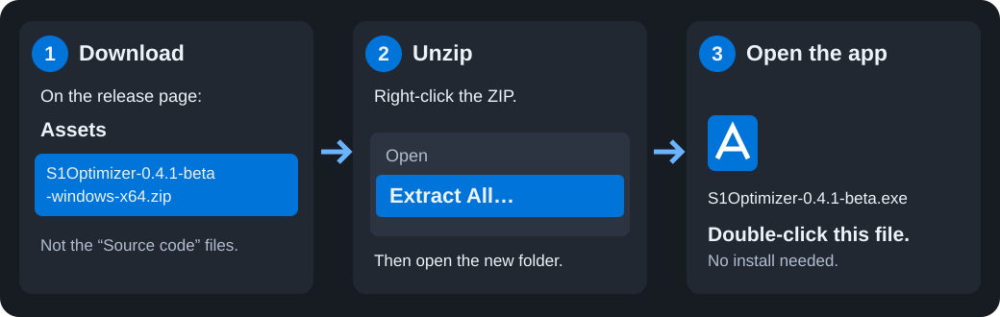
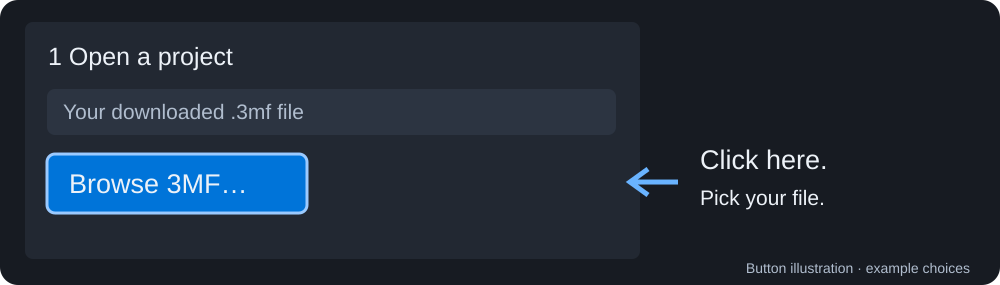
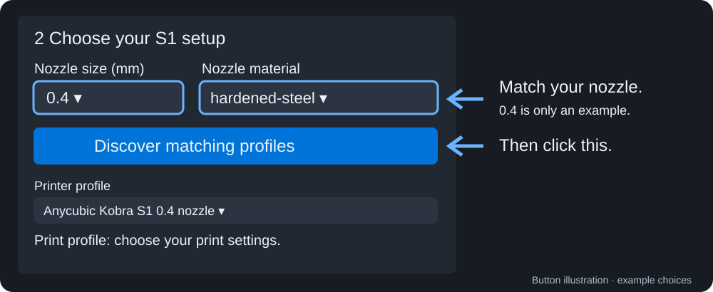
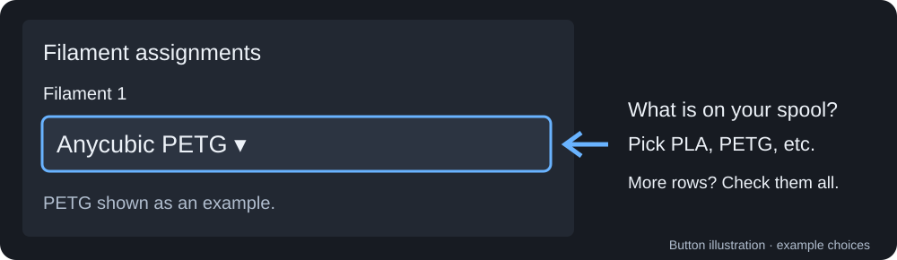
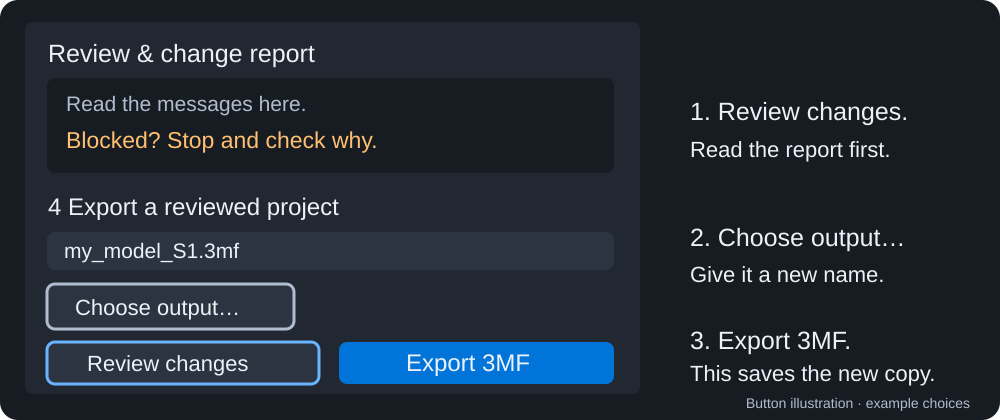
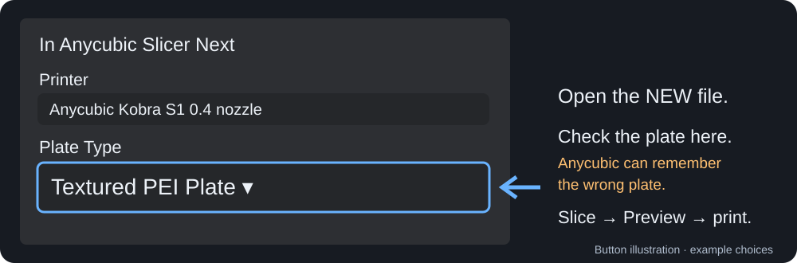

# Using the Kobra S1 Optimizer

This app takes a 3MF project and makes a new copy for your Kobra S1. It does
not change the file you started with, start a print, or send anything to your
printer. You still open the new file in Anycubic Slicer Next and check it
before printing.

Before you begin, install and set up Anycubic Slicer Next on this computer,
with a Kobra S1 printer ready in it. The app uses the printer profiles already
installed by the slicer. If you have not set up the S1 in Anycubic yet, do
that first.

## 1. Download and open the app

[Open the download page](https://github.com/Hello-dot-Jpg/MakerWorldToKobraS1/releases/tag/v0.4.1-beta).
Under **Assets**, download `S1Optimizer-0.4.1-beta-windows-x64.zip`. Do not
download either file called **Source code**; those files are not the Windows
app.

When the download is done, right-click the ZIP file and choose **Extract All**.
Open the folder Windows made, then double-click
`S1Optimizer-0.4.1-beta.exe`. Keep the licence files in that folder. You do not
need Python or a separate installer. Windows may show a security warning
because the app is unsigned; follow your usual Windows security rules.

## 2. Open the project you want to convert

Click **Browse 3MF…** and choose the 3MF project you downloaded. This loads the
project and shows details about the original file in **Original project**.
You can also paste a file path into the box and press Enter.

The original file is kept as it is. If you load a different project later,
the app resets the conversion choices. Check your choices again after loading
another file.

## 3. Choose the nozzle and print settings

Look at the nozzle fitted to your printer. Choose that size under **Nozzle
size (mm)**. For example, if your nozzle is 0.4 mm, choose **0.4**. Choose the
right **Nozzle material** too. Then click **Discover matching profiles** and
wait for the search to finish.

Check **Printer profile** shows your Kobra S1 and nozzle size. Then choose a
**Print profile**. A print profile is a saved group of printing settings. The
picture uses a 0.4 mm hardened-steel nozzle as an example; choose what is
actually fitted to your printer. Selecting **hardened-steel** by itself does
not add special community settings. See [Extra choices and fixes](docs/EXTRA_OPTIONS.md)
if you have a community profile bundle.

The original file's layer height stays in use by default, even after you choose a
print profile. Turn on **Use print profile's layer height** only if you want to
use the height saved in that print profile. You can instead enter a number in
**Custom layer height (mm)**. If you are unsure, leave these settings alone.

## 4. Choose the filament

Under **Filament assignments**, choose the material that is really on your
spool, such as PLA or PETG. If the project has more than one row, each row is
one filament used by the project. Check every row and choose the right
material for each one.

These choices assign filaments to this project. They do not add new presets to
Anycubic's filament list. For adding separate filament presets, use the
instructions on the [extra choices page](docs/EXTRA_OPTIONS.md).

## 5. Review, then save a new file

Click **Review changes**. This checks your choices and shows messages in the
report. Review does not save or create a converted project. Read the messages.
If anything is blocked, stop and find out why; do not guess a way around it.

Check the output path on the right, or click **Choose output…** to pick a
folder and file name. Choose a new name, such as `my_model_S1.3mf`. The app
will not overwrite your original project or an existing output file. When the
name is ready, click **Export 3MF**. This is the step that saves the new
project. Keep the change report with it so you can see what the app changed.

## 6. Open and check the new project

Open the new 3MF file in Anycubic Slicer Next. Before slicing, check the
printer and nozzle, the material and temperature settings, and **Plate Type**.
For the usual textured plate, choose **Textured PEI Plate**. Anycubic can
switch back to the last plate you used, so check this every time.

If the project has more than one plate, check every plate you plan to print.
Slice the project, then look at **Preview**. Check the model, supports, and
the paths the nozzle will follow. Stop if Anycubic shows a printer G-code
warning you do not understand. G-code is the printer's instructions; do not
approve unknown printer commands just to continue.

The project contains a print profile named **[Optimized]** for the converted
project. The original settings are kept only for comparison, not as another
print choice. They are not safe to print as-is on the S1. Conversion and slicing do not
test your filament or prove that its temperatures are right. Check the
settings against your printer and filament before printing.

The pictures on this page are labelled illustrations of the buttons, not
screenshots. The app may look a little different on your computer.

[Need extra settings, community profiles, filament imports or help with a warning?](docs/EXTRA_OPTIONS.md)
