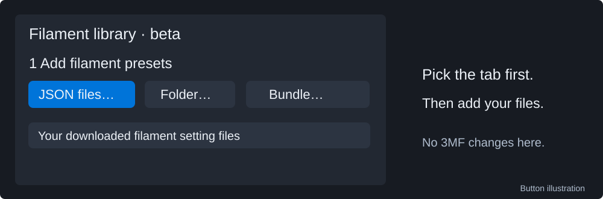
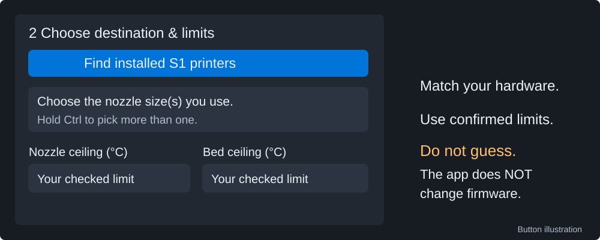
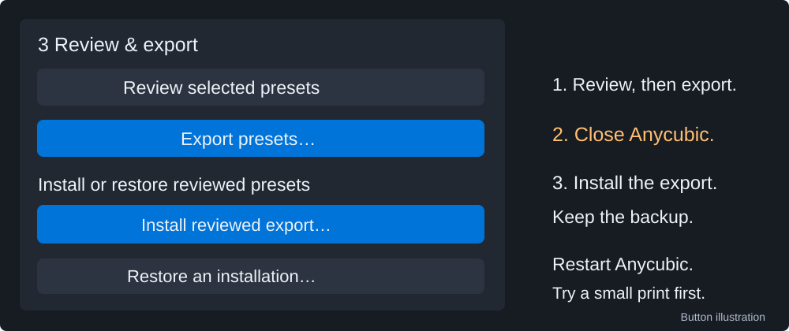

# Extra choices and fixes

Use this page when you need an option beyond the basic 3MF conversion steps.

## Optional 3MF settings

Open the **3MF projects** tab. The settings on the left scroll; the report and
save buttons stay on the right.

- **Use print profile's layer height** uses the height saved in the chosen
  print profile. Leave it off to keep the height from the original file. You
  can enter a **Custom layer height (mm)** instead.
- **Build plate** starts at **Textured PEI Plate**. Check **Plate Type** again
  in Anycubic Slicer Next because it may switch back to the last plate you used.
- **Nice supports - beta** uses the reviewed support settings. Check the result
  in **Preview**.
- **Scale to fit S1 plate** shrinks a model that is too large for the plate.
  This changes its size. Leave it off when the part must keep its exact size.
- **Advanced · hotend limits** records your hotend choice. Only enter a nozzle
  temperature limit you have confirmed for your hardware and firmware. The app
  does not guess a safe limit.
- **Advanced · community profile bundles** lets you add a profile bundle you
  already have. Click **Add bundle…**, then run **Discover matching profiles**
  again. Choosing hardened steel by itself does not add a community profile.

Choosing another file resets the choices. Check them again before saving.
Click **Review changes** and read the report before you click **Export 3MF**.
The exported **[Optimized]** print profile is made for this project. The
original settings are kept only for comparison, not as another print choice.
They are not safe to print as-is on the S1. Check the printer, nozzle, filament, plate and
Preview in Anycubic Slicer Next before printing. A successful conversion does
not test or tune your filament.

## Add separate filament presets

This is for adding presets to Anycubic's filament list. It does not change the
filaments assigned inside a 3MF project.

1. Open **Filament library · beta**. Add files with **JSON files…**,
   **Folder…**, **Bundle…** or **INI file…**. You can get presets separately,
   for example from Siddament. Added presets are selected at first; use Ctrl or
   Shift to change the selection.

   

2. Click **Find installed S1 printers**. Pick the nozzle size or sizes you
   need, then choose **Nozzle material** and **Hotend**.
3. Check **Nozzle ceiling (°C)** and **Bed ceiling (°C)** against your own
   hardware and firmware. These are the highest temperatures your own setup
   can safely use. Do not copy someone else's limits or assume a filled-in
   number is right for your printer. Unknown limits or a material that does
   not match can stop the export. This app does not change printer firmware.

   

4. Click **Review selected presets**. Read the warnings, then click
   **Export presets…**. This makes a new folder of presets; they still need to
   be tested with your filament.
5. To install from the app, close Anycubic Slicer Next first. Open
   **Install or restore reviewed presets**, click **Install reviewed
   export…**, choose the export and read the confirmation. Keep the
   `install-manifest.json` file and backup folder in case you need to undo it.

   

6. Or import `importable-presets.zip` or the JSON files in Anycubic with
   **Import Configs**. The app cannot undo this manual import.
7. Restart Anycubic. Find the presets under the right nozzle size. Check the
   material and temperatures, then try a small print before a long one.

## Undo an app install

Close Anycubic Slicer Next. Open **Install or restore reviewed presets**, click
**Restore an installation…** and choose the install record. Read the result.
If a preset changed after installation, the app keeps that changed file in a
separate backup folder instead of deleting it. The app may stop if restoring the
backup would replace other files.
Do not copy files over Anycubic's preset folders by hand.

## If something goes wrong

- **No profiles found:** Set up a Kobra S1 in Anycubic Slicer Next, then try
  **Discover matching profiles** again. A community bundle cannot replace the
  slicer's installed printer and print profiles.
- **Model does not fit:** Read the report. Use **Scale to fit S1 plate** only
  if a smaller part is okay. Otherwise, move or split the model in the slicer.
- **Export is blocked or Anycubic shows a warning:** Stop and read the message.
  Do not raise temperature limits or approve machine start code just to clear
  a warning.
- **Reporting a bug:** Include the app version, nozzle and profiles you chose,
  the exact message and the change report. Remove private paths or settings.
  Do not send another person's model without permission.
